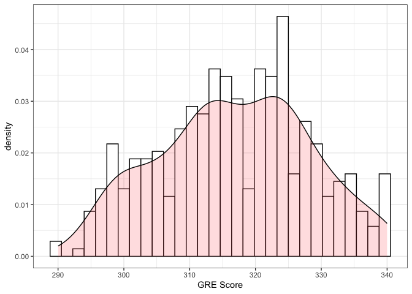
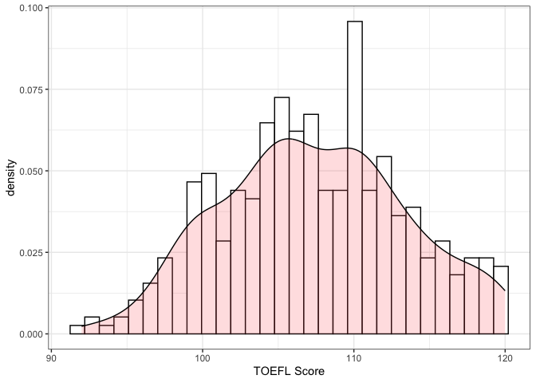
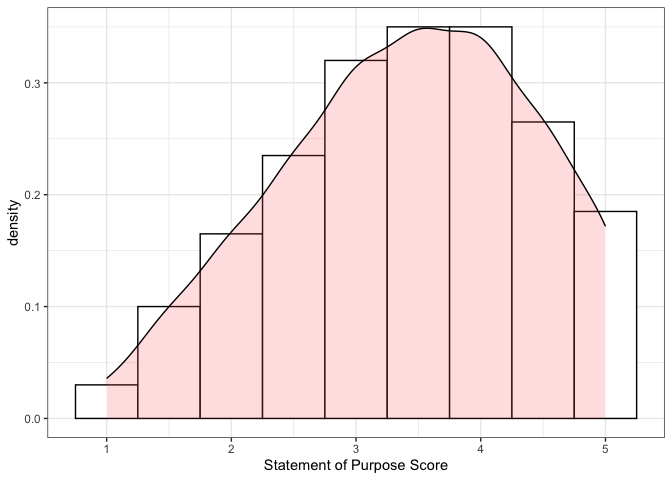
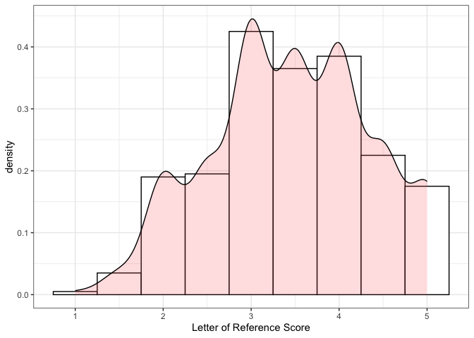
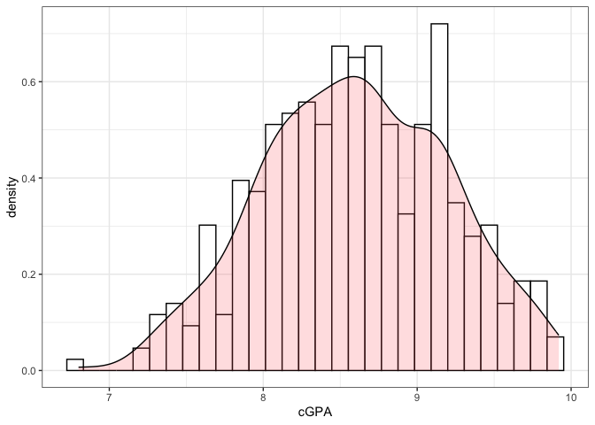

## Description

The purpose of this analysis is to investigate which factors influence admissions to computer science graduate programs.

## Load data and dependencies


```r
library(data.table)
library(ggplot2)
library(fmsb)
```


```r
adm_dat <- fread("../data/adm_data.csv", sep = ",")
```

## Data exploration

We're going to explore the data to gain insights into its features (e.g., number of columns and rows, data types). 


```r
# str() gives me a general idea of the data (e.g., it has 400 rows and 9 columns)
adm_dat[, str(.SD)]
```

```
## Classes 'data.table' and 'data.frame':	400 obs. of  9 variables:
##  $ Serial No.       : int  1 2 3 4 5 6 7 8 9 10 ...
##  $ GRE Score        : int  337 324 316 322 314 330 321 308 302 323 ...
##  $ TOEFL Score      : int  118 107 104 110 103 115 109 101 102 108 ...
##  $ University Rating: int  4 4 3 3 2 5 3 2 1 3 ...
##  $ SOP              : num  4.5 4 3 3.5 2 4.5 3 3 2 3.5 ...
##  $ LOR              : num  4.5 4.5 3.5 2.5 3 3 4 4 1.5 3 ...
##  $ CGPA             : num  9.65 8.87 8 8.67 8.21 9.34 8.2 7.9 8 8.6 ...
##  $ Research         : int  1 1 1 1 0 1 1 0 0 0 ...
##  $ Chance of Admit  : num  0.92 0.76 0.72 0.8 0.65 0.9 0.75 0.68 0.5 0.45 ...
##  - attr(*, ".internal.selfref")=<externalptr> 
##  - attr(*, ".data.table.locked")= logi TRUE
```

```
## NULL
```


```r
# print top 5 rows
adm_dat[, head(.SD)]
```

```
##    Serial No. GRE Score TOEFL Score University Rating SOP LOR CGPA Research
## 1:          1       337         118                 4 4.5 4.5 9.65        1
## 2:          2       324         107                 4 4.0 4.5 8.87        1
## 3:          3       316         104                 3 3.0 3.5 8.00        1
## 4:          4       322         110                 3 3.5 2.5 8.67        1
## 5:          5       314         103                 2 2.0 3.0 8.21        0
## 6:          6       330         115                 5 4.5 3.0 9.34        1
##    Chance of Admit
## 1:            0.92
## 2:            0.76
## 3:            0.72
## 4:            0.80
## 5:            0.65
## 6:            0.90
```

### Metadata

Let's refer to the data source and its metadata. This dataset is downloaded from [here](https://www.kaggle.com/datasets/akshaydattatraykhare/data-for-admission-in-the-university). Based on the metadata, it contains the following features so this seems to line up with what we observed so far in terms of data types (e.g., GRE score is an integer data type).

* GRE Scores (out of 340)
* TOEFL Scores (out of 120)
* University Rating (out of 5)
* Statement of Purpose (SOP) (out of 5)
* Letter of Recommendation (LOR) Strength (out of 5)
* Undergraduate GPA (out of 10)
* Research Experience (either 0 or 1)
* Chance of Admit (ranging from 0 to 1)

### Descriptive statistics

Another way to explore the data is to look at descriptive statistics. For example, this will help us confirm if GRE scores are indeed out of 340 and the same applies to the other features.


```r
# get the descriptive stats of each column
adm_dat[, summary(.SD)]
```

```
##    Serial No.      GRE Score      TOEFL Score    University Rating
##  Min.   :  1.0   Min.   :290.0   Min.   : 92.0   Min.   :1.000    
##  1st Qu.:100.8   1st Qu.:308.0   1st Qu.:103.0   1st Qu.:2.000    
##  Median :200.5   Median :317.0   Median :107.0   Median :3.000    
##  Mean   :200.5   Mean   :316.8   Mean   :107.4   Mean   :3.087    
##  3rd Qu.:300.2   3rd Qu.:325.0   3rd Qu.:112.0   3rd Qu.:4.000    
##  Max.   :400.0   Max.   :340.0   Max.   :120.0   Max.   :5.000    
##       SOP           LOR             CGPA          Research     
##  Min.   :1.0   Min.   :1.000   Min.   :6.800   Min.   :0.0000  
##  1st Qu.:2.5   1st Qu.:3.000   1st Qu.:8.170   1st Qu.:0.0000  
##  Median :3.5   Median :3.500   Median :8.610   Median :1.0000  
##  Mean   :3.4   Mean   :3.453   Mean   :8.599   Mean   :0.5475  
##  3rd Qu.:4.0   3rd Qu.:4.000   3rd Qu.:9.062   3rd Qu.:1.0000  
##  Max.   :5.0   Max.   :5.000   Max.   :9.920   Max.   :1.0000  
##  Chance of Admit 
##  Min.   :0.3400  
##  1st Qu.:0.6400  
##  Median :0.7300  
##  Mean   :0.7244  
##  3rd Qu.:0.8300  
##  Max.   :0.9700
```


```r
# calculate sd for continuous variables
adm_dat[, lapply(.SD, sd), .SDcols = c(2, 3, 5:7, 9)]
```

```
##    GRE Score TOEFL Score      SOP       LOR      CGPA Chance of Admit
## 1:  11.47365    6.069514 1.006869 0.8984775 0.5963171       0.1426093
```

### Missing values

Before moving on, we should also check for missing values in the dataset.


```r
# count number of missing values in each column
adm_dat[, lapply(.SD, function(x) sum(is.na(x))), .SDcols = 1:9]
```

```
##    Serial No. GRE Score TOEFL Score University Rating SOP LOR CGPA Research
## 1:          0         0           0                 0   0   0    0        0
##    Chance of Admit
## 1:               0
```

There are no missing values in this dataset so we don't have to conduct any pre-processing to account for missing values. 

### Data preprocessing

There are a few things we should clean up before moving on to visualization and analysis. First, let's change how the columns are named.


```r
# change the column names to all lowercase letters and replace space with underscore
new_colnames <- gsub(" ", "_", tolower(names(adm_dat)))

# there is a . in serial_no. so let's get rid of that too
new_colnames <- gsub("[.]", "", new_colnames)

# replace column names in the data with new_colnames
setnames(adm_dat, names(adm_dat), new_colnames)

# let's check out the new column names
names(adm_dat)
```

```
## [1] "serial_no"         "gre_score"         "toefl_score"      
## [4] "university_rating" "sop"               "lor"              
## [7] "cgpa"              "research"          "chance_of_admit"
```

For the purpose of this paper, we're going to use the chance of admit feature to create a new feature, which is acceptance. Although the original dataset provided chance of admit as the response variable, it just doesn't make much sense to use it in this analysis since we have no idea how it is collected or calculated. 

To be fair, this dataset is not a *real*. It is created for educational/practice purposes only. To create the acceptance feature, chance of admit values over 0.7 will be assigned 1 (accepted to the graduate program) whereas chance of admit values below and equal to 0.7 will be assigned 0 (not accepted to the graduate program). This is based on the mean of chance of admit values in the dataset (mean = 0.7244).


```r
# create the acceptance column based on the above cut offs
# let's check the number of rows based on both cut offs
adm_dat[chance_of_admit > 0.7, .N]
```

```
## [1] 235
```

```r
adm_dat[chance_of_admit <= 0.7, .N]
```

```
## [1] 165
```

```r
# now create the new feature
adm_dat[chance_of_admit > 0.7, acceptance := 1]
adm_dat[chance_of_admit <= 0.7, acceptance := 0]

# do a sanity check count
adm_dat[, .N, by = acceptance]
```

```
##    acceptance   N
## 1:          1 235
## 2:          0 165
```

```r
# ok, the number of rows seems to add up so this is good.
```
There are a few features that should be treated as categorical variables. These include university rating, research, and acceptance.


```r
# change a few variables to factors
factor_cols <- c("university_rating", "research", "acceptance")

adm_dat[, (factor_cols) := lapply(.SD, as.factor), .SDcols = factor_cols]
```

We are going to check two-way contingency table for the categorical predictors to make sure there are no empty cells.


```r
xtabs(~acceptance + research, data = adm_dat)
```

```
##           research
## acceptance   0   1
##          0 124  41
##          1  57 178
```

```r
xtabs(~acceptance + university_rating, data = adm_dat)
```

```
##           university_rating
## acceptance  1  2  3  4  5
##          0 24 80 50  9  2
##          1  2 27 83 65 58
```

## Data visualization

We will visualize the continuous variables by creating a few histogram plots. 

### GRE score


```r
ggplot(adm_dat, aes(x = gre_score)) + 
  geom_histogram(aes(y=..density..), color = "black", fill = "white") +
  geom_density(alpha = .2, fill = "#FF6666") +
  theme_bw() +
  labs(x = "GRE Score")
```

```
## Warning: The dot-dot notation (`..density..`) was deprecated in ggplot2 3.4.0.
## ℹ Please use `after_stat(density)` instead.
```

```
## `stat_bin()` using `bins = 30`. Pick better value with `binwidth`.
```

<!-- -->


### TOEFL score


```r
ggplot(adm_dat, aes(x = toefl_score)) + 
  geom_histogram(aes(y=..density..), color = "black", fill = "white") +
  geom_density(alpha = .2, fill = "#FF6666") +
  theme_bw() +
  labs(x = "TOEFL Score")
```

```
## `stat_bin()` using `bins = 30`. Pick better value with `binwidth`.
```

<!-- -->


### SOP


```r
ggplot(adm_dat, aes(x = sop)) + 
  geom_histogram(aes(y=..density..), color = "black", fill = "white", binwidth = 0.5) +
  geom_density(alpha = .2, fill = "#FF6666") +
  theme_bw() +
  labs(x = "Statement of Purpose Score")
```

<!-- -->


### LOR


```r
ggplot(adm_dat, aes(x = lor)) + 
  geom_histogram(aes(y=..density..), color = "black", fill = "white", binwidth = 0.5) +
  geom_density(alpha = .2, fill = "#FF6666") +
  theme_bw() +
  labs(x = "Letter of Reference Score")
```

<!-- -->


### cGPA


```r
ggplot(adm_dat, aes(x = cgpa)) + 
  geom_histogram(aes(y=..density..), color = "black", fill = "white") +
  geom_density(alpha = .2, fill = "#FF6666") +
  theme_bw() +
  labs(x = "cGPA")
```

```
## `stat_bin()` using `bins = 30`. Pick better value with `binwidth`.
```

<!-- -->


## Multiple logistic regression

Use a multiple logistic regression model to predict acceptance based on gre_score, toefl_score, university_rating, sop, lor, cgpa, and research. 


```r
model <- glm(acceptance ~ gre_score + toefl_score + university_rating + sop + lor + cgpa + research, data = adm_dat, family = "binomial")

summary(model)
```

```
## 
## Call:
## glm(formula = acceptance ~ gre_score + toefl_score + university_rating + 
##     sop + lor + cgpa + research, family = "binomial", data = adm_dat)
## 
## Deviance Residuals: 
##      Min        1Q    Median        3Q       Max  
## -2.62100  -0.41383   0.06164   0.39465   2.21953  
## 
## Coefficients:
##                     Estimate Std. Error z value Pr(>|z|)    
## (Intercept)        -54.65488    7.96426  -6.863 6.77e-12 ***
## gre_score            0.08208    0.02837   2.893 0.003814 ** 
## toefl_score          0.07108    0.05395   1.318 0.187655    
## university_rating2  -0.05199    1.02532  -0.051 0.959561    
## university_rating3   0.38963    1.04075   0.374 0.708122    
## university_rating4   0.31032    1.19501   0.260 0.795111    
## university_rating5   1.32756    1.39471   0.952 0.341170    
## sop                 -0.20498    0.26547  -0.772 0.440024    
## lor                  0.69910    0.27560   2.537 0.011191 *  
## cgpa                 2.26671    0.61043   3.713 0.000205 ***
## research1            0.84165    0.33870   2.485 0.012958 *  
## ---
## Signif. codes:  0 '***' 0.001 '**' 0.01 '*' 0.05 '.' 0.1 ' ' 1
## 
## (Dispersion parameter for binomial family taken to be 1)
## 
##     Null deviance: 542.20  on 399  degrees of freedom
## Residual deviance: 250.23  on 389  degrees of freedom
## AIC: 272.23
## 
## Number of Fisher Scoring iterations: 6
```

Based on this output, gre_score, lor, cgpa, and research have significant effects on admission to computer science graduate programs.

Now, there are few things left to do. First, we want to know if the overall model is significant or not. 


```r
with(model, null.deviance - deviance)
```

```
## [1] 291.9758
```

```r
with(model, df.null - df.residual)
```

```
## [1] 10
```

```r
with(model, pchisq(null.deviance - deviance, df.null - df.residual, lower.tail = FALSE))
```

```
## [1] 7.714216e-57
```

The p-value < 0.001 so the overall model is statistically significant.

Next, we want to calculate odds ratio and 95% CI. 


```r
exp(coef(model))
```

```
##        (Intercept)          gre_score        toefl_score university_rating2 
##       1.835211e-24       1.085539e+00       1.073664e+00       9.493404e-01 
## university_rating3 university_rating4 university_rating5                sop 
##       1.476441e+00       1.363859e+00       3.771840e+00       8.146600e-01 
##                lor               cgpa          research1 
##       2.011943e+00       9.647583e+00       2.320186e+00
```

```r
exp(cbind(OR = coef(model), confint(model)))
```

```
## Waiting for profiling to be done...
```

```
##                              OR        2.5 %       97.5 %
## (Intercept)        1.835211e-24 1.175019e-31 4.857669e-18
## gre_score          1.085539e+00 1.027916e+00 1.149414e+00
## toefl_score        1.073664e+00 9.662102e-01 1.194850e+00
## university_rating2 9.493404e-01 1.508915e-01 9.301082e+00
## university_rating3 1.476441e+00 2.217344e-01 1.452066e+01
## university_rating4 1.363859e+00 1.415727e-01 1.671325e+01
## university_rating5 3.771840e+00 2.757052e-01 7.130922e+01
## sop                8.146600e-01 4.817429e-01 1.369901e+00
## lor                2.011943e+00 1.182903e+00 3.498907e+00
## cgpa               9.647583e+00 2.990795e+00 3.305885e+01
## research1          2.320186e+00 1.193043e+00 4.523088e+00
```

Finally, we want to calculate the Nagelkerke R-squared value of the model.


```r
NagelkerkeR2(model)
```

```
## $N
## [1] 400
## 
## $R2
## [1] 0.698023
```


## Intepretation

* A logistic regression was conducted to predict the likelihood of gaining admission into a computer science graduate program based on GRE score, TOEFL score, rating of undergraduate university, statement of purpose score, letter of reference score, cGPA, and research experience. 

* The logistic regression model was statistically significant ($\chi^2$ (10, *N* = 400) = 291.98, *p* < .001). 

* The model accounted for 69.8% (Nagelkerke *$R^2$*) of the variance in gaining admission into a computer science graduate program. 

* GRE score, letter of reference score, cGPA, and research experience, but not TOEFL score, rating of undergraduate university, and statement of purpose score, were associated with gaining admission into a computer science graduate program (see multiple logistic regression output). 

* Increase in GRE score (OR = 1.086, 95% C.I. (1.028, 1.149)), letter of reference score (OR = 2.012, 95% C.I. (1.183, 3.499)), and cGPA (OR = 9.648, 95% C.I. (2.991, 33.059)) were associated with an increased likelihood of gaining admission into a computer science graduate program.

* The model also showed that having research experience is associated with a higher likelihood of gaining admission into a computer science graduate program compared to having no research experience (OR = 2.320, 95% C.I. (1.193, 4.523)). 

The end.


